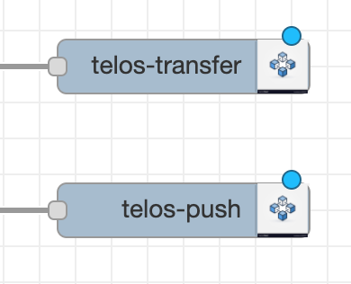

# Telos Node-Red NPM Package

Telos is a public eosio blockchain run by independent people around the world. This repository is for the development of a node-red NPM module that connects data to the blockchain.

Here you will find the javascript and HTML code for the "telos-transfer" node as well as the "telos-push" in a future version.

## Direct Usage

Before using the nodes built in this package, it's important that you download and install the appropriate Node-Red file from https://nodered.org/.

You can install this project and all its dependencies in your home .node-red location. This can be done with:

```
cd $HOME/.node-red
npm install node-red-contrib-telos-eosio
```

You should see a package-lock.json file and a folder called node_modules that includes eosjs libraries for interacting with the blockchain.

## Example flow usage

The example flow files require other NPM node-red packages to work properly.

## Twitter API Trading Bot

Twitter is the platform of choice for many blockchain enthusiasts. It is where traders can follow and interact with developers or tweet about interesting projects.

With a developer account, tweets can be aggregated and analyzed through the Twitter Application Interface (or API).

### Requirements

Go to developer.twitter.com and create a developer twitter account. It is your responsibility to answer the questions honestly and to the best of your ability.

Once your developer account is activated, create an "app," so that you can obtain both API keys and Access tokens.

Before using the nodes built in this package, it's important that you download and install the appropriate Node-Red file from https://nodered.org/.

Install the twitter API node by doing the following:

```
cd $HOME/.node-red
npm install node-red-node-twitter
```

Start Node-Red and navigate to the local server in a browser window.

Import the .json flow file located in the "examples" folder into Node-Red.

If no errors emerge and all nodes appear in the flow, double click on the blue node called "Analyze Tweets".

Select the pencil icon located next to "Add new twitter-credentials" to enter your developer Twitter ID, API keys, and Access tokens.


